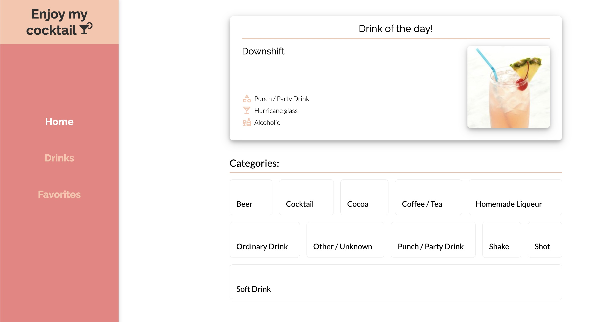

# Enjoy my cocktail 

Welcome to Enjoy my cocktail!

This is an application to browse a wide variety of drinks, and maybe get some inspiration for you home bar!🍹



## Contributors

| <div style="width:180px">Full Name</div> | Email                 |
| ---------------------------------------- | --------------------- |
| Magnus Tomter Ouren                      | magnutou@stud.ntnu.no |
| Ole Remi Dahl                            | olerd@stud.ntnu.no    |
| Jakob Relling                            | jakobere@stud.ntnu.no |
| Magnus Byrkjeland                        | magnueb@stud.ntnu.no  |

## API

The data used in the application is retrieved from [The Cocktail DB](https://www.thecocktaildb.com/).

## Technologies

The project uses the following technologies:

- [Vite](https://vitejs.dev/)
- [Vitest](https://vitest.dev/)
- [Typescript](https://www.typescriptlang.org/)
- [Tanstack Query](https://tanstack.com/query/latest)
- [Eslint](https://eslint.org/)
- [Stylelint](https://stylelint.io/)
- [Prettier](https://prettier.io/)

## Environment

The application is built on `node v20.5.0` and `npm v9.8.1`. We cannot guarantee that other versions of node will run the project without complications.

> <i>Note: The project cannot be run with node 20.6.0.</i>

To set correct node version with nvm, run:

```cli
nvm install 20.5.0
```

```cli
nvm use 20.5.0
```

To set correct npm version, run:

```cli
npm install -g npm@9.8.1
```

## Start development

To start the project locally, run:

```cli
npm install
```

After successful install, run:

```cli
npm run dev
```

The project will be executed locally and be hosted through a local port. Look to the terminal to find the correct URL.

<i>More information about the scripts can be found below.</i>

## Available NPM Scripts

This section provides an overview of the available npm scripts for this project. These scripts help you manage development, testing, building, and other maintenance tasks for the project.

### Setup

| <div style="width:150px">Command</div> | Description                                                                                       |
| -------------------------------------- | ------------------------------------------------------------------------------------------------- |
| `npm install`                          | Installs all dependencies to run the project locally.                                             |
| `npm run dev`                          | Starts Vite locally in development mode. Any code changes will trigger automatic browser updates. |
| `npm start`                            | This script also starts Vite development mode and behaves identically to `npm run dev`.           |

### Testing

| <div style="width:150px">Command</div> | Description                                                                                                 |
| -------------------------------------- | ----------------------------------------------------------------------------------------------------------- |
| `npm test`                             | This script runs tests using Vitest. It will execute all tests in the project.                              |
| `npm run coverage`                     | Runs the unit-tests and generates a code coverage report. It will be located [here](./coverage/index.html). |

### Code Quality

| <div style="width:150px">Command</div> | Description                                                                                                                |
| -------------------------------------- | -------------------------------------------------------------------------------------------------------------------------- |
| `npm run lint`                         | Runs ESLint to check for style errors and code issues. It will also report any unused ESLint-disable directives.           |
| `npm run lint:fix`                     | Runs ESLint with the --fix flag to automatically fix eligable formatting issues and style errors in project files.         |
| `npm run lint:css`                     | Runs Stylelint to check CSS files in the project for style errors and code issues.                                         |
| `npm run format`                       | Runs Prettier to format spesified files in the project according to the configuration defined in the .prettierrc.cjs file. |

### Production

| <div style="width:150px">Command</div> | Description                                                                                 |
| -------------------------------------- | ------------------------------------------------------------------------------------------- |
| `npm run build`                        | Builds the project with Vite. More information below.                                       |
| `npm run preview`                      | Runs the built project locally. `npm run build` must have been run for this script to work. |

## Prepare for production

Before production, the project needs to be compiled and built. This can be done by running the following script:

```
npm run build
```

It builds the project for production using Vite. It will perform the following steps:

- Run linting for TypeScript files.
- Run linting for SCSS files.
- Run TypeScript compilation.
- Run Vite bundling.

```cli
npm run preview
```

This script starts Vite in preview mode, allowing you to preview the production build locally before deployment.

## Pipeline (CI/CD)

The project is set up with Gitlab Pipeline. It is configured to do the following:

- Install all dependencies for the project.
- Run all tests and retrieve coverage report.
- Run linting to assert the code follows formatting rules.
- Build the project.

The pipeline automatically runs on every push to the repo. The Pipeline must pass in order to merge a branch with `main`.

<i>If you want to </i>skip the pipeline for a push, add `-o ci.skip` to the git command.

## Filestructure

This project follows a specific file structure. This section provides an overview of the file structure and describes what should be in the various folders and files. It also describes how testing is performed in the project.

- [Project filestructure](./docs/filestructure-project.md)
- [Component filestructure](./docs/filestructure-component.md)

## Query caching

We have implemented query caching in the application. This means that when a user searches for a drink, category, etc., the application will cache the query and the result. If the user searches for the same drink again, the application will use the cached result instead of making a new request to the API. This will improve the performance of the application.

The caching is implemented using tanstack QueryClient with SyncStoragePersister. Read more about it [here](https://tanstack.com/query/latest/docs/react/plugins/persistQueryClient?from=reactQueryV3&original=https%3A%2F%2Ftanstack.com%2Fquery%2Fv3%2Fdocs%2Fplugins%2FpersistQueryClient).

## Responsiveness

The user experience and responsivness of the application have been tested using Chrome Devtools and our personal mobile phones (iPhone 12).

## Feedback and improvements after first delivery

[Feedback and improvements](./docs/feedback.md)
